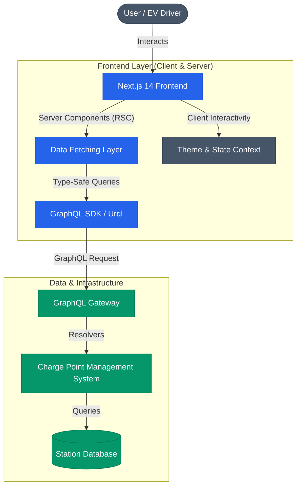

# EV Charging Infrastructure Dashboard

[Uploading voltron1.mp4…](https://github.com/prog-ops/voltron_app/assets/59245989/19a0657e-125d-4c50-85b1-2bea5349e153)

## 📖 Executive Summary & Business Value

EV Charging Infrastructure Dashboard is a next-generation frontend application designed to bridge the gap between Electric Vehicle (EV) drivers and charging infrastructure. As the global transition to sustainable transportation accelerates, "Range Anxiety" and "Charging Uncertainty" remain significant barriers to adoption.

This project addresses these critical friction points by providing:

1.  **Transparency**: Real-time visibility into tariff structures (kWh price, admin fees, taxes) to prevent "billing shock."
2.  **Reliability**: Live status updates on connector availability and maximum power output, ensuring drivers don't navigate to broken or occupied stations.
3.  **Accessibility**: A high-performance, accessible web interface optimized for both desktop planning and mobile on-the-go usage.

From a business perspective, providing accurate, granular data reduces customer support overhead and increases station utilization rates by effectively routing demand to available assets.

## 🏗️ Architecture & Engineering Best Practices

This project leverages a modern **Headless Architecture**, decoupling the high-performance Next.js frontend from the backend services via a strict **GraphQL** interface. This ensures type safety, reduces over-fetching, and enables a highly decoupled development workflow.

### High-Level Architecture



### Technical Decision Record (TDR)

| Technology                  | Role           | Justification                                                                                                                                                                                            |
| --------------------------- | -------------- | -------------------------------------------------------------------------------------------------------------------------------------------------------------------------------------------------------- |
| **Next.js 14 (App Router)** | Framework      | Leveraging **React Server Components (RSC)** for minimizing client-side bundle size and maximizing SEO performance. The `app` directory structure enforces better route handling and layout composition. |
| **TypeScript**              | Language       | Strict static typing is non-negotiable for enterprise-grade applications dealing with financial data (tariffs) and infrastructure status to prevents runtime errors.                                     |
| **GraphQL**                 | API Protocol   | Eliminates "over-fetching" (saving bandwidth on mobile) and "under-fetching" (reducing round-trips). Allows the client to request _exactly_ the pricing and status fields needed.                        |
| **Tailwind CSS**            | Styling        | Utility-first CSS provides a highly maintainable design system, reduces CSS bundle fragmentation, and enables rapid UI iteration with built-in dark mode support.                                        |
| **Urql / Apollo**           | GraphQL Client | Robust caching strategies and normalized data management to ensure UI consistency without redundant network requests.                                                                                    |

## 🚀 Features

### Core Functionality

- **Station Discovery**: List view of available public charging stations with ease-of-access information (City, Address).
- **Connector Analytics**: detailed breakdown of charging points, including:
  - Connector Type (Type 2, CCS, etc.)
  - Max Power Output (kW)
  - Real-time Availability Status
- **Tariff Intelligence**: Comprehensive breakdown of costs including:
  - Base Price per kWh
  - Admin Fees & Connection Fees
  - Tax Calculations
  - Applied Discounts

### Developer Experience (DX)

- **Strict Linting**: Pre-configured ESLint rules to enforce code quality.
- **Atomic Design**: Components organized by complexity (Atoms -> Molecules -> Organisms) in `components` and `custom-components`.
- **Dark Mode**: First-class support for system-preference aware theming via React Context.

## 🛠️ Getting Started

Follow these instructions to set up the development environment.

### Prerequisites

- **Node.js**: v18.17.0 or higher (LTS recommended)
- **npm** or **pnpm**: Package manager

### Installation

1.  **Clone the repository**

    ```bash
    git clone https://github.com/your-org/voltron-app.git
    cd voltron-app
    ```

2.  **Install Dependencies**

    ```bash
    npm install
    # or
    yarn install
    # or
    pnpm install
    ```

3.  **Environment Setup**
    Create a `.env.local` file in the root directory and configure your GraphQL endpoint:

    ```bash
    NEXT_PUBLIC_GRAPHQL_ENDPOINT=https://your-api-endpoint.com/graphql
    ```

4.  **Run Development Server**
    ```bash
    npm run dev
    ```
    Open [http://localhost:3000](http://localhost:3000) to view the application.

## 🧩 Project Structure

A breakdown of the key directories within the codebase:

```
voltron_app/
├── app/
│   ├── components/         # Specific application components (Business Logic aware)
│   ├── custom-components/  # Generic, reusable UI components (Buttons, Headings)
│   ├── graphql/           # GraphQL Query/Mutation definitions (.gql)
│   ├── hooks/             # Custom React Hooks (e.g., useDarkMode)
│   ├── layout.tsx         # Root layout (Html, Body, Providers)
│   └── page.tsx           # Home page route
├── public/                # Static assets
└── ...config files        # Tailwind, Next.js, TSConfig
```

## 🔮 Future Roadmap

- [ ] **Map Integration**: Visualizing stations on an interactive map (Mapbox/Google Maps).
- [ ] **User Accounts**: Authentication flow for saving favorite stations and payment methods.
- [ ] **Booking System**: Reservation capability for high-demand chargers.
- [ ] **Offline Mode**: Service Worker implementation for basic functionality in low-connectivity areas (underground parking).
